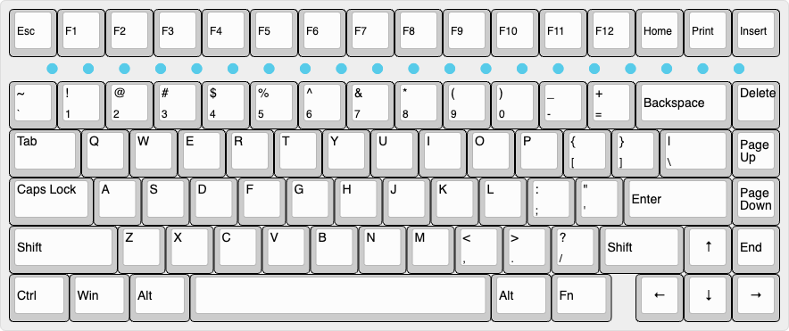
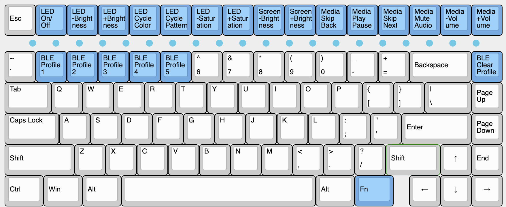

# 1 // Functionality

## Overview

The PhaseOne uses the latest and in our opinion, greatest, open-source firmware, [ZMK](https:www.zmk.dev). It supports Bluetooth and Wired keyboard operation and is built by a great community of contributors. Within a few months, ZMK will have a webpage to ZMK Studio to easily further customize your board without any coding ability. 

## Layout

The PhaseOne ships with configuration to support up to 5 Bluetooth connections and Wired performance with the following keymap:

### Normal Keymap

The normal keymap is a legend of what occurs when pressing a specific key.

### Fn Layer Keymap

The `Fn` or function keymap is a legend of what occurs when holding down the `Fn` key and pressing another key.

## Charging

The PhaseOne automatically charges when connected to a USB outlet with a USB-C cable. You can tell the PhaseOne is charging when the LED on the back of the board under the space bar is illuminated. When completed charging, the LED will turn off.  

## Bluetooth

The PhaseOne Bluetooth functionality supports 5 profiles (5 different stored connections to devices). The profiles allow you to quickly switch between connected devices.

### Pairing with Bluetooth

To pair a device with the PhaseOne, like your computer, phone, or other device:

1. Select the profile you want to store the connection on. You can do this by pressing the `Fn` key and `1,2,3,4, or 5.`
2. Once on the selected profile, the PhaseOne automatically starts pairing mode and will display as "PhaseOne". 
3. On the device you’d like to connect to, pull up the Bluetooth menu and select PhaseOne. Depending on the device, this can take a couple tries. 
4. Once the connected device says pairing successful, you’re good to go!

### Clearing and Repairing with Bluetooth

For security reasons in ZMK, you cannot pair a new device to a profile on PhaseOne until the selected profile is cleared. To clear a profile: 

1. First select the profile you would like to clear using `Fn` key and `1,2,3,4, or 5.`
2. Use the `Fn` key + `Del` to clear the selected profile
 
### Bluetooth Controls

| Method      | Description                          |
| :---------- | :----------------------------------- |
| `Fn + 1`    | :material-numeric-1-box: Pair/Connect to Device 1 |
| `Fn + 2`    | :material-numeric-2-box: Pair/Connect to Device 2 |
| `Fn + 3`    | :material-numeric-3-box: Pair/Connect to Device 3 |
| `Fn + 4`    | :material-numeric-4-box: Pair/Connect to Device 4 |
| `Fn + 5`    | :material-numeric-5-box: Pair/Connect to Device 5 |
| `Fn + Delete` | :simple-bluetooth: Clear Currently Selected Bluetooth Connections |

## LED Bar Controls

| Method      | Description                          |
| :---------- | :----------------------------------- |
| `Fn + F1`   | :material-toggle-switch: LED On/Off |
| `Fn + F2`   | :material-brightness-6: Decrease LED Brightness |
| `Fn + F3`   | :material-brightness-7: Increase LED Brightness |
| `Fn + F4`   | :material-format-color-fill: Cycle LED Colour |
| `Fn + F5`   | :material-string-lights: Cycle LED Pattern |
| `Fn + F6`   | :material-circle-half: Decrease LED Saturation |
| `Fn + F7`   | :material-circle: Increase LED Saturation |

## Media Controls

| Method      | Description                          |
| :---------- | :----------------------------------- |
| `Fn + F8`   | :low_brightness: Decrease Screen Brightness |
| `Fn + F9`   | :high_brightness: Increase Screen Brightness |
| `Fn + F10`  | :material-skip-previous: Skip Previous |
| `Fn + F11`  | :material-play-pause: Play/Pause |
| `Fn + F12`  | :material-skip-next: Skip Next |
| `Fn + Home`   | :material-volume-off: Mute Audio |
| `Fn + Print`  | :material-volume-low:  Decrease Volume |
| `Fn + Insert` | :material-volume-high: Increase Volume |

## All Controls

| Method      | Description                          |
| :---------- | :----------------------------------- |
| `Fn + F1`   | :material-toggle-switch: LED On/Off |
| `Fn + F2`   | :material-brightness-6: Decrease LED Brightness |
| `Fn + F3`   | :material-brightness-7: Increase LED Brightness |
| `Fn + F4`   | :material-format-color-fill: Cycle LED Colour |
| `Fn + F5`   | :material-string-lights: Cycle LED Pattern |
| `Fn + F6`   | :material-circle-half: Decrease LED Saturation |
| `Fn + F7`   | :material-circle: Increase LED Saturation |
| `Fn + F8`   | :low_brightness: Decrease Screen Brightness |
| `Fn + F9`   | :high_brightness: Increase Screen Brightness |
| `Fn + F10`  | :material-skip-previous: Skip Previous |
| `Fn + F11`  | :material-play-pause: Play/Pause |
| `Fn + F12`  | :material-skip-next: Skip Next |
| `Fn + Home`   | :material-volume-off: Mute Audio |
| `Fn + Print`  | :material-volume-low:  Decrease Volume |
| `Fn + Insert` | :material-volume-high: Increase Volume |
| `Fn + 1`    | :material-numeric-1-box: Pair/Connect to Device 1 |
| `Fn + 2`    | :material-numeric-2-box: Pair/Connect to Device 2 |
| `Fn + 3`    | :material-numeric-3-box: Pair/Connect to Device 3 |
| `Fn + 4`    | :material-numeric-4-box: Pair/Connect to Device 4 |
| `Fn + 5`    | :material-numeric-5-box: Pair/Connect to Device 5 |
| `Fn + Delete` | :simple-bluetooth: Clear Currently Selected Bluetooth Connections |

